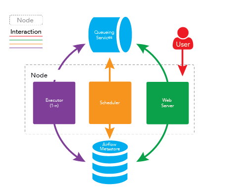
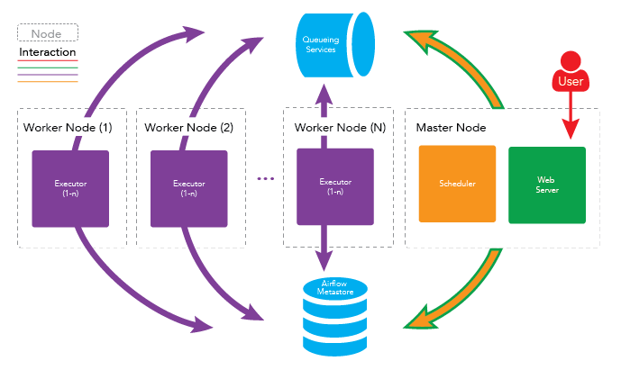
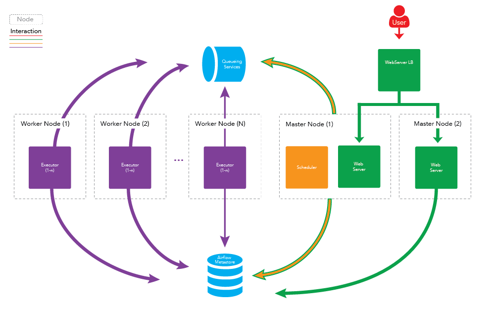
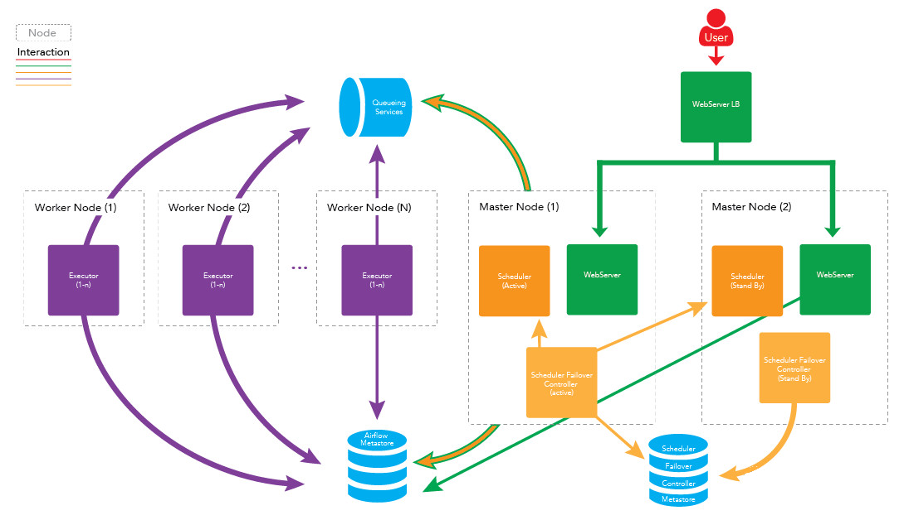

# Apache-Airflow

## Airflow解决哪些问题

通常，在一个运维系统，数据分析系统，或测试系统等大型系统中，我们会有各种各样的依赖需求。包括但不限于：

- 时间依赖：任务需要等待某一个时间点触发。
- 外部系统依赖：任务依赖外部系统需要调用接口去访问。
- 任务间依赖：任务A需要在任务B完成后启动，两个任务互相间会产生影响。
- 资源环境依赖：任务消耗资源非常多，或者只能在特定的机器上执行。

crontab可以很好处理定时执行任务的需求，但仅能管理时间上的依赖。

Airflow是一种WMS，即：它将任务以及它们的依赖看做代码，按照那些计划规范任务执行，并在实际工作进程之间分发需执行的任务。

Airflow提供了一个用于显示当前活动任务和过去任务状态的优秀UI，并允许用户手动管理任务的执行和状态。

Airflow中的工作流是具有方向性依赖的任务集合。

具体说就是Airflow的核心概念DAG（有向无环图）——来表现工作流。

DAG中的每个节点都是一个任务，DAG中的边表示的是任务之间的依赖（强制为有向无环，因此不会出现循环依赖，从而导致无限执行循环）。


## Airflow的守护进程

Airflow系统在运行时有许多守护进程，它们提供了Airflow的全部功能。守护进程包括WEB服务器：WebServer、调度程序：scheduler、执行单元：worker、消息队列监控工具：Flower等。


### WebServer

WebServer是一个守护进程，它接受HTTP请求、允许通过其它WEB应用程序与Airflow进行交互，WebServer提供以下功能：

- 中止、恢复、触发任务  
- 监控正在运行的任务，断电续跑任务
- 执行ad-hoc命令或SQL语句来查询任务的状态，日志等详细信息
- 配置连接，包括不限于数据库、ssh的连接等

WebServer守护进程使用gunicorn服务器处理并发请求，可通过修改{AIRFLOW_HOME}/airflow.cfg文件中workers的值来控制处理并发请求的进程数。
例如：

```python
workers = 4 # 表示开启4个gunicoen worker处理web请求
```

启动WebServer守护进程：
```bash
airflow webserver -D
```

### scheduler

scheduler是一个守护进程，它周期性轮询任务的调度计划，以确定是否触发任务执行。

启动scheduler守护进程：

```bash
airflow scheduler -D
```

### worker

worker是一个守护进程，它启动一个或多个celery任务队列，负责执行具体的DAG任务。

当设置Airflow的executors设置为CeleryExecutor时才需要开启worker守护进程。

启动worker守护进程，默认的队列名为default：

```bash
airflow worker -D
```

### flower

flower是一个守护进程，可用于通过web页面监控celery消息队列。

启动flower守护进程：

```bash
airflow flower -D
```

默认的端口为5555，可以在浏览器通过地址<http://localhost:5555>来访问flower，对celery消息队列进行监控。

## Airflow的守护进程是如何一起工作的

需要注意的是Airflow的守护进程彼此之间是独立的，他们并不相互依赖，也不相互感知。每个守护进程在运行时只处理分配到自己身上的任务，他们在一起运行时，提供了Airflow的全部功能。

1. 调度器scheduler会间隔性地轮询元数据库（Metastore）已注册的DAG是否需要被执行。如果一个具体的DAG根据其调度计划需要被执行，scheduler守护进程就会先在元数据库创建一个DagRun实例，并触发DAG内部的具体task，触发其实并不是真正的去执行，而是推送task消息至消息队列中（Broker）中，每一个task消息都包含task的DAG ID，task ID，及具体需要被执行的函数。如果task是要执行bash脚本，那么task消息还会包含bash脚本的代码。

2. 用户可以在WebServer上来控制DAG，比如手动触发一个DAG去执行。当用户这样做的时候，一个DagRun的实例将在元数据库被创建，scheduler去触发DAG中具体的task。

3. worker守护进程将会监听消息队列，如果有消息就从消息队列中取出消息，当取出任务消息时，它会更新元数据库中的DagRun实例的状态为正在运行，并尝试执行DAG中的task，如果DAG执行成功，则更新DagRun实例的状态为成功，否则更新状态为失败。

## Airflow单节点部署

将以上所有守护进程运行在同一台机器上即可完成Airflow的单节点部署，架构如下图所示



## Airflow多节点（集群）部署

在稳定性要求较高的场景，如金融交易系统中，一般采用集群、高可用的方式来部署。Apache Airflow同样支持集群、高可用部署，Airflow的守护进程可分布在多台机器上运行，架构如下图所示：



### 特点

- 高可用  
如果一个worker节点崩溃或离线时，集群仍可以被控制的，其他worker节点的任务仍会被执行。

- 分布式  
如果你的工作流中邮一些内存密集型的任务，任务最好是分布在多台机器上运行以便得到更快的执行。

### 扩展worker节点

- 水平拓展  
可以通过向集群中添加更多worker节点来水平地扩展集群，并使这些新节点指向同一个元数据库，从而分发处理过程。由于worker不需要再任何进程注册即可执行任务，因此所有worker节点可以在不停机、不重启服务的情况下进行拓展，也就是说可以随时扩展。
- 垂直拓展  
可以通过增加单个worker节点的守护进程数来垂直扩展集群。可以通过修改Airflow的配置文件：{AIRFLOW_HOME}/airflow.cfg中celeryd_concurrency的值来实现。

### 扩展master节点

向集群中添加更多master节点，以扩展主节点上运行的服务。可以扩展WebServer守护进程，以防止太多的HTTP请求出现在一台机器上，或者为WebServer的服务提供更高的可用性。需要注意的一点是，每次只能运行一个scheduler守护进程。如果有多个scheduler运行，那么就有可能一个任务被执行多次，这可能会导致工作流因重复运行而出现一些问题。



### 高可用scheduler

可能会有这样一个问题，scheduler不能同时运行两个，那么运行scheduler的节点一旦出现问题，任务不就完全不能运行了吗？可以采取下面的解决方案，在两台机器上部署scheduler，只运行一台机器上的scheduler守护进程，一旦运行scheduler守护进程的机器出现故障，立刻启动另一台机器上的scheduler即可。借助第三方组件airflow-scheduler-failover-controller实现scheduler的高可用。

具体实现步骤如下：

1. 下载failover  
```bash
git clone https://github.com/teamclairvoyant/airflow-scheduler-failover-controller
```

2. 运行pip安装  
```bash
cd {AIRFLOW_FAILOVER_CONTROLLER_HOME}

pip install -e .
```

3. 初始化failover

```bash
scheduler_failover_controller init
```

注：初始化时，会向airflow.cfg中追加内容，因此需要先安装Airflow并初始化。

4. 更改failover配置

```bash
scheduler_nodes_in_cluster = host1,host2
```

注：host name可以通过scheduler_failover_controller_get_current_host命令获得

5. 配置安装failover的机器之间的免密登陆，配置完成后，可以使用如下命令进程验证：

```bash
scheduler_failover_controller test_connection
```

6. 启动failover

```bash
scheduler_failover_controller satrt
```

因此更健壮的架构图如下所示：



### 队列服务及元数据库（Metestore）的高可用

- 队列服务的高可用取决于使用的消息队列是否可以高可用部署，如RabbitMQ和Redis。  
RabbitMQ集群部署及配置Mirrored模式：<http://blog.csdn.net/u010353408/article/details/77964190>

- 元数据库（Metestore）的高可用取决于所使用的数据库，如Mysql等。  
Mysql做主从备份：<http://blog.csdn.net/u010353408/article/details/77964157>

## Airflow集群部署的具体步骤

1. 在所有需要运行守护进程的机器上安装Apache Airflow。具体安装方法可参考<https://www.jianshu.com/p/9bed1e3ab93b>
2. 修改{AIRFLOW_HOME}airflow.cfg文件，确保所有机器使用同一份配置文件
   - 修改Executor为CeleryExcetor  
   
   ```bash
   executor = CelrryExecutor
   ```
   - 指定元数据库（Metestore）  
   ```bash
   sql_alchemy_conn = mysql://{USENAME}:{PASSWROD}@{MYSQL_HOST}:{MYSQL_PORT}/airflow
   ```
   - 设置中间人（Boker）  
   如RabbitMQ:
   ```bash
   broker_url = amqp://guest:guest@{RABBITMQ_HOT}:{RABBITMQ_PORT}
   ```  
   如Redis：
   ```bash
   broker_url = redis://{REDIS_HOST}:{REDIS_PORT}/{REDSI_DB}
   ```
   - 设定结果存储后端Backend
   ```bash
   celery_result_backend = db+mysql://{USERNAME}:{PASSWORD}@{MYSQL_HOST}:{MYSQL_PORT}/airflow # 也可以redis:celery_result_backend = redis://{REDIS_HOST}:{REDIS_PORT}/{REDIS_DB}
   ```
3. 在master1和master2上部署工作流（DAGs）
4. 在master1初始化Airflow的元数据库
```bash
airflow initdb
```
5. 在master1启动相应的守护进程
```bash
airflow webserver
```

```bash
airflow scheduler
```
6. 在master2中启动WebServer
```bash
airflow webserver
```
7. 在worker1和worker2中启动worker
```bash
airflow worker
```
8. 使用负载均衡处理WebServer
可以使用nginx，AWS等服务器处理WebServer的负载均衡。
